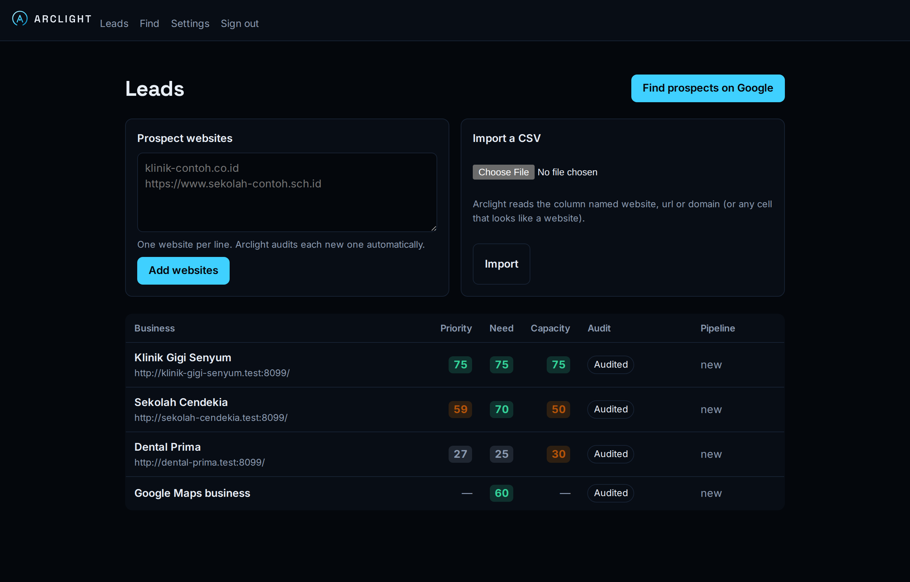

<p align="center">
  <picture>
    <source media="(prefers-color-scheme: dark)" srcset="docs/brand/logo-on-dark.svg">
    
  </picture>
</p>

<p align="center"><strong>Your agency's always-on lead hunter.</strong></p>

<p align="center">
  Arclight finds businesses that need what your agency sells, proves it with evidence from their
  own website, and drafts the first message. You review it and press send.
</p>

<p align="center">
  <a href="docs/getting-started.md">Getting started</a> ·
  <a href="docs/user-guide.md">User guide</a> ·
  <a href="docs/api.md">API</a> ·
  <a href="docs/ROADMAP.md">Roadmap</a> ·
  <a href="docs/README.md">All documentation</a>
</p>

> [!NOTE]
> **Early access.** Arclight is used today by one agency ([Vera & Co.](docs/VISION.md#origin)) and is changing quickly. Expect rough edges, and please [report them](https://github.com/yordanchusein1/JARVIS/issues).



## What it does

1. **Find.** Search Google Maps for businesses such as "dental clinics in Surabaya", paste a list of websites, or import a CSV.
2. **Audit.** Arclight visits each business's own website and measures what matters: speed on phones, HTTPS, outdated technology, contact and booking forms, published contacts and social links.
3. **Score.** Every lead gets a **need** score (how much they need you) and a **capacity** score (whether they are established enough to pay). Their geometric mean, **priority**, puts the best leads first.
4. **Draft.** Claude writes a WhatsApp message and an email in your agency's voice that cite only what was measured. Numbers that the audit never measured are flagged.
5. **You send.** One click opens WhatsApp or your email client with the message filled in. Track each lead from _new_ to _won_.


## Principles

- **Human in the loop.** Arclight never sends a message on its own.
- **Official data only.** Google Places is used for search, and only place IDs are stored, as Google's terms require. Maps and social networks are never scraped.
- **Do-not-contact list.** Businesses that ask to be left alone are never tracked, shown or drafted again.
- **Self-hosted.** Your leads stay on your server.
- **Open.** A documented HTTP API, a typed SDK, and (planned) an MCP server so AI agents can use Arclight as a tool.

## Quick start

You need [Docker](https://docs.docker.com/get-docker/), a [Google Cloud API key](docs/getting-started.md#2-create-a-google-cloud-api-key) and an [Anthropic API key](docs/getting-started.md#3-create-an-anthropic-api-key).

```sh
git clone https://github.com/yordanchusein1/JARVIS arclight && cd arclight
cp .env.example .env    # fill in the keys, DASHBOARD_PASSWORD and SESSION_SECRET
docker compose up -d --build
```

Then create an API key for the dashboard, add it to `.env` and open http://localhost:3000. The [getting started guide](docs/getting-started.md) walks through every step, including creating the API keys.

## How it is built

| Part           | Path             | Technology                                   | License  |
| -------------- | ---------------- | -------------------------------------------- | -------- |
| Engine         | `packages/core`  | TypeScript, PostgreSQL (Drizzle), pg-boss    | AGPL-3.0 |
| API and worker | `apps/api`       | Hono, OpenAPI 3.1                            | AGPL-3.0 |
| Dashboard      | `apps/dashboard` | Next.js                                      | AGPL-3.0 |
| SDK            | `packages/sdk`   | Typed client generated from the OpenAPI spec | MIT      |
| Website        | `apps/web`       | Next.js (static)                             | AGPL-3.0 |

The dashboard uses only the public API, the same way your own website or an AI agent would. Read more in [Architecture](docs/ARCHITECTURE.md) and the [decision log](docs/DECISIONS.md).

## Contributing

Issues, ideas and feedback are very welcome. See [CONTRIBUTING.md](CONTRIBUTING.md) for how to set up a development environment, and [SECURITY.md](SECURITY.md) for reporting vulnerabilities.

## License

The engine, API, dashboard and website are licensed under [AGPL-3.0](LICENSE). The SDK in `packages/sdk` is [MIT](packages/sdk/LICENSE), so you can use it in closed-source admin panels.

Arclight is not affiliated with Marvel.
