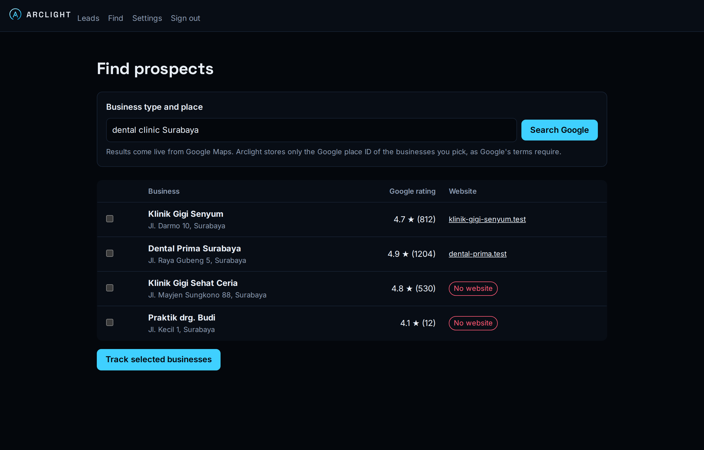
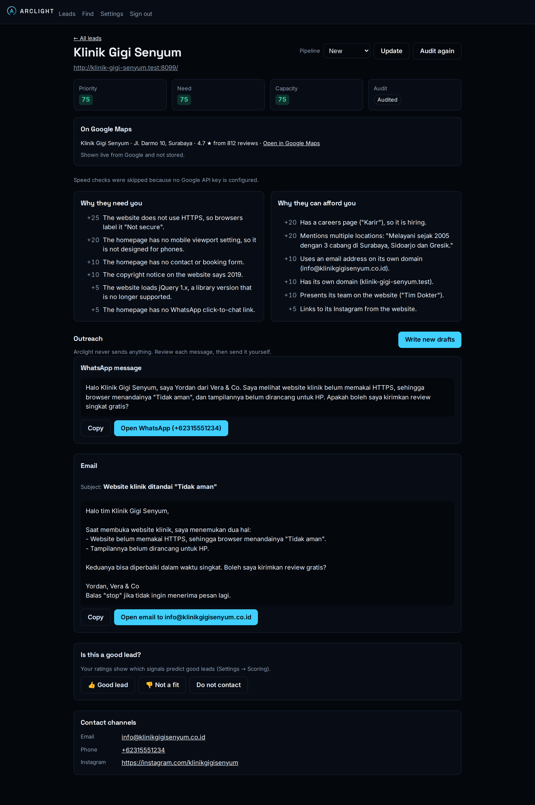

# User guide

This guide explains every screen of the Arclight dashboard and how Arclight decides which leads are worth your time. If Arclight isn't installed yet, start with [Getting started](getting-started.md).

- [The idea in one minute](#the-idea-in-one-minute)
- [Agency profile](#agency-profile)
- [Adding prospects](#adding-prospects)
- [Audits: what Arclight checks](#audits-what-arclight-checks)
- [Scores and priority](#scores-and-priority)
- [Writing and sending messages](#writing-and-sending-messages)
- [Pipeline](#pipeline)
- [Tuning the scores](#tuning-the-scores)
- [Do-not-contact list](#do-not-contact-list)

## The idea in one minute

A good prospect has two things: a **need** you can see (a slow website, no HTTPS, no website at all) and the **capacity** to pay for your help (several branches, a team, a careers page). Arclight measures both from public information, ranks leads by the combination, and writes a first message that mentions only what it measured. You decide who gets a message, and you send it yourself.

## Agency profile

**Settings → Agency profile.** Fill this in before writing any messages.

| Field            | Used for                                                                         |
| ---------------- | -------------------------------------------------------------------------------- |
| Agency name      | Introducing yourself and signing emails                                          |
| Your name        | The sender of every message                                                      |
| What you offer   | Choosing which findings matter. Be specific: "websites for clinics and schools". |
| Tone             | The voice of the messages, e.g. "friendly and professional" or "casual"          |
| Message language | Bahasa Indonesia or English                                                      |

## Adding prospects

There are three ways to add businesses. Every new business is audited automatically.

### Search Google Maps

**Find** searches Google Maps, for example `dental clinic Surabaya` or `private school Bandung`. The results show each business's Google rating, number of reviews and whether it lists a website. Use them to pick established businesses, then tick them and click **Track selected businesses**.

Google's terms don't allow storing names, addresses or reviews from Google Maps, so Arclight stores only Google's place ID. On a lead's page you'll see the live Google details, fetched each time. In the leads list, such a business is called "Google Maps business" until Arclight has visited its website and read the name from it.

### Paste websites

On **Leads**, paste website addresses, one per line (`klinik.co.id` is enough). Addresses that can't be a public website, such as `localhost` or an IP address, are rejected, and websites already in Arclight aren't added twice.

### Import a CSV

On **Leads**, choose a CSV file and click **Import**. Arclight uses the column named `website`, `url` or `domain`; without one, it takes every cell that looks like a website address. Files exported from Excel with semicolons work too. Up to 1,000 websites per file.

## Audits: what Arclight checks

For each business Arclight visits the homepage of its website, asks Google PageSpeed Insights how it performs on phones, and records **signals**. Every signal comes with a sentence of evidence, and only these sentences may be used in messages.

### Need: why they need you

| Signal               | Points | Evidence example                                                             |
| -------------------- | -----: | ---------------------------------------------------------------------------- |
| `no_website`         |     60 | The business has no website listed on its Google Maps profile.               |
| `unreachable`        |     40 | The website could not be loaded when Arclight visited it.                    |
| `http_error`         |     40 | The homepage returned an error (HTTP 500).                                   |
| `no_https`           |     25 | The website does not use HTTPS, so browsers label it "Not secure".           |
| `slow_mobile`        |  10–25 | Google PageSpeed Insights rates the mobile performance 34/100.               |
| `no_viewport`        |     20 | The homepage has no mobile viewport setting.                                 |
| `free_subdomain`     |     15 | The website runs on a free subdomain (klinik.wixsite.com).                   |
| `slow_lcp`           |   5–10 | For real visitors on phones, the main content takes 5.2 s to appear.         |
| `outdated_copyright` |     10 | The copyright notice on the website says 2019.                               |
| `no_contact_form`    |     10 | The homepage has no contact or booking form.                                 |
| `legacy_jquery`      |      5 | The website loads jQuery 1.x, a library version that is no longer supported. |
| `old_wordpress`      |      5 | The website runs an outdated WordPress version (4.9).                        |
| `no_whatsapp`        |      5 | The homepage has no WhatsApp click-to-chat link.                             |

### Capacity: why they can afford you

| Signal               | Points | Evidence example                                      |
| -------------------- | -----: | ----------------------------------------------------- |
| `careers_page`       |     20 | Has a careers page ("Karir"), so it is hiring.        |
| `multiple_locations` |     20 | Mentions multiple locations: "3 cabang di Surabaya…"  |
| `own_domain`         |     10 | Has its own domain (klinik.co.id).                    |
| `business_email`     |     10 | Uses an email address on its own domain.              |
| `team_page`          |     10 | Presents its team on the website ("Tim Dokter").      |
| `social_presence`    |   5–15 | Links to its Instagram and Facebook from the website. |

Arclight also collects the **contact channels** the business publishes on its homepage: email addresses, phone and WhatsApp numbers, and Instagram, Facebook, TikTok and LinkedIn profiles.

**Good to know**

- If a website's `robots.txt` asks automated tools to stay away, Arclight skips the homepage checks and says so on the lead.
- Keyword-based checks (branches, careers, team) look for common Indonesian and English words. They can miss things or misread them. Your 👍 and 👎 ratings help you spot which ones to trust.
- **Audit again** on a lead's page re-checks the website, for example after you've spoken with the business.

## Scores and priority

- **Need** (0–100): the sum of the need points, capped at 100.
- **Capacity** (0–100): the sum of the capacity points, capped at 100.
- **Priority**: the geometric mean, √(need × capacity).

The geometric mean rewards leads that score on _both_ sides. A thriving business with a perfect website (high capacity, no need) and a tiny business with a broken one (high need, no capacity) both rank below an established business with visible problems.

**Businesses without a website** have an unknown capacity (shown as "—"): there is no website to judge from, so their priority is also unknown and they appear after scored leads. Their Google rating on the lead page is your best guide. Instagram signals planned for v0.2 will fill this gap.

Colours: green is 60 or more, amber 30–59, grey below 30.

## Writing and sending messages

On a lead's page, **Write messages** asks Claude for a WhatsApp message and an email, based on the audit evidence and your agency profile.

The messages follow firm rules:

- They cite only facts from the evidence: no industry statistics, no invented results.
- They are respectful and end with a low-pressure question.
- The email ends with a line telling the recipient they can reply "stop".

**Warnings.** If a draft contains a number (above 30) that doesn't appear in the evidence or your profile, such as "our clients see 200% more bookings", Arclight shows a warning. Remove or check such claims before sending.

**Sending.** Arclight never sends anything. Use:

- **Copy** to paste the message anywhere.
- **Open WhatsApp** to open a chat with the business's WhatsApp or phone number and the message filled in. For businesses without a website, the phone number from Google Maps is offered.
- **Open email** to open your email program with the subject and message filled in.

**Write new drafts** replaces the drafts, for example after you've changed your profile or re-audited the website.

## Pipeline

Each lead has a status: **New → Contacted → Replied → Meeting → Won / Lost**. Change it at the top of the lead's page. The leads list shows the status next to each lead.

## Tuning the scores

Arclight's default points are a starting point. Two tools help you adapt them to your agency.

**Rate leads.** On each lead's page, click **👍 Good lead** or **👎 Not a fit**. Click again to remove the rating.

**Adjust points.** **Settings → Scoring** lists every signal Arclight has found, how many leads have it, and how many of those you rated 👍 or 👎. If a signal shows up mostly on 👎 leads, give it fewer points. Saving recalculates every score immediately; you don't need to re-audit.

## Do-not-contact list

When a business asks not to be contacted, respect it permanently:

- On the lead's page, **Do not contact** adds the website's domain to the list and marks the lead **Lost**.
- **Settings → Do not contact** manages the list: website domains, email addresses and phone numbers, each with an optional reason.

Arclight will then refuse to track that domain again, hide listed emails and phone numbers everywhere, and refuse to write messages for the business.
